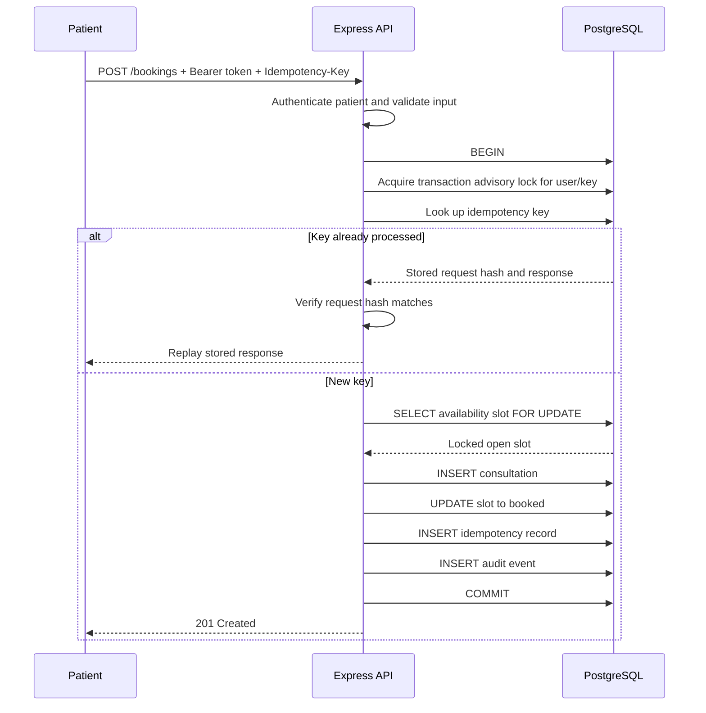

# Booking flow sequence

```mermaid
sequenceDiagram
    participant P as Patient
    participant API as Express API
    participant DB as PostgreSQL
    P->>API: POST /bookings + Bearer token + Idempotency-Key
    API->>API: Authenticate patient and validate input
    API->>DB: BEGIN
    API->>DB: Acquire transaction advisory lock for user/key
    API->>DB: Look up idempotency key
    alt Key already processed
        DB-->>API: Stored request hash and response
        API->>API: Verify request hash matches
        API-->>P: Replay stored response
    else New key
        API->>DB: SELECT availability slot FOR UPDATE
        DB-->>API: Locked open slot
        API->>DB: INSERT consultation
        API->>DB: UPDATE slot to booked
        API->>DB: INSERT idempotency record
        API->>DB: INSERT audit event
        API->>DB: COMMIT
        API-->>P: 201 Created
    end
```
